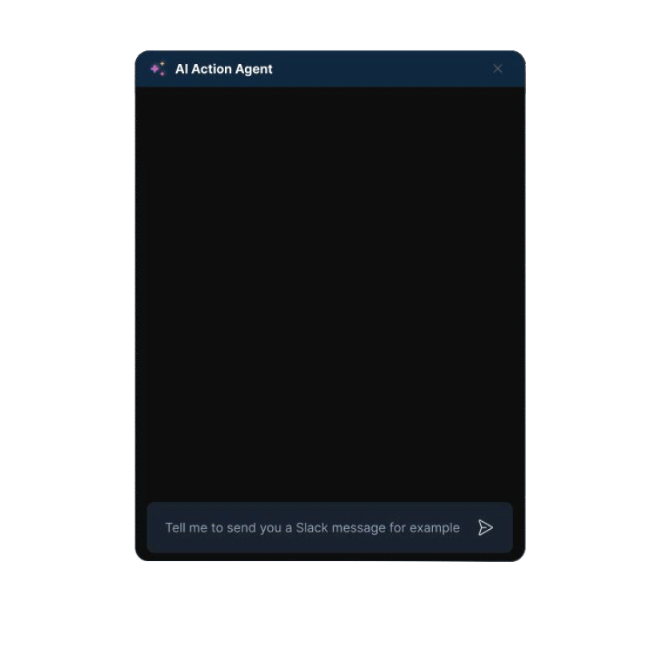

# Fastn: embedded integration platform for AI agents

Customers expect your product to work seamlessly with the tools they already rely on. Fastn makes it easy to deliver native integrations that connect with your users' apps, without the overhead of building and maintaining complex backend infrastructure.

Fastn provides access to over 15000+ tools through its extensive library of connectors, enabling your AI agents to automate and orchestrate workflows across a vast ecosystem of SaaS apps and services.

**With Fastn, you get:**

* **A fully branded integration portal**\
  Let your users connect and manage integrations directly inside your product with a polished, native experience.
* **Prebuilt and custom connectors**\
  Use Fastn's library of ready-to-go connectors or build your own to support any app your customers need.
* **Scalable multitenant architecture**\
  Support every customer with isolated environments, role-based access, and per-tenant customization out of the box.
* **Built-in monitoring and visibility**\
  Track integration activity, catch issues early, and get clear insights into how everything's performing.

### Integrate Instantly with 1000+ Connectors

_Connect Everything in Your Stack_

Fastn includes a growing library of[ 100&#x30;**+ Connectors**](https://fastn.ai/integrations) that are pre-built to unify your tech ecosystem. No more writing custom integration code; just plug, play, and automate.

<figure><figcaption></figcaption></figure>

New connectors are constantly being added via the Fastn Marketplace, where you can also find reusable widgets, logic modules, and third-party integrations ready to drop into your flows.

## Browse by Products

<strong>UCL</strong>

Securely connect your AI agents to the tools your users already rely on with enterprise scale in mind.

<figure><figcaption></figcaption></figure>

<strong>Integration Hub</strong>

An embedded app store that lets your users seamlessly connect and manage their apps directly inside your SaaS platform.

<figure><figcaption></figcaption></figure>

<strong>AI Automation</strong>

Build enterprise grade automations ten times faster using the power of generative AI.

<figure><figcaption></figcaption></figure>

## Browse by Use Case

<strong>Workflow Automation</strong>

Fastn makes it easy to build and run automated workflows across your integrations. Whether you're syncing data, sending notifications, or triggering actions based on events, everything runs in the background, reliably and at scale.

An example is Fastn's **Zap Trigger Subscribe** to kick off a Zapier workflow whenever a new contact is added in your app. This lets your users instantly connect Fastn-powered actions with 5,000+ tools on Zapier, without writing a single line of code.

<figure><figcaption></figcaption></figure>

<strong>Event-Driven Triggers &#x26; Actions</strong>

Once you've registered and set up your webhook routes in Fastn, you can configure triggers to automate when and how your workflows run.

Triggers let you schedule workflows to run automatically, at set intervals or specific times, without any manual input.

For example, you want to send a daily status update to your Slack channel every morning? Or maybe post a summary every 15 minutes? Fastn allows you to automate messages to Slack (or any connected app) based on your chosen schedule, so your team always stays in the loop.

<figure><figcaption></figcaption></figure>

<strong>Data Ingestion &#x26; Transformation</strong>

Build reliable background pipelines that pull in your users' third-party data and update it in real time. With Fastn Flows, you can set up powerful, scalable automation

For example, automatically ingest Salesforce contacts and sync them into your users' HubSpot accounts as they update.

Fastn handles the heavy lifting so you can focus on your product, not data plumbing.

<figure><figcaption></figcaption></figure>

<strong>Bi-Directional Sync</strong>

Keep your product and your customers' tools in perfect sync with real-time, reliable two-way data flows.\
For example:

* Sync Salesforce contacts to HubSpot on a scheduled basis.
* Instantly push HubSpot contacts to Salesforce when new data is added.

Fastn makes two-way syncing seamless, whether it's time-based or triggered by events.

<figure><figcaption></figcaption></figure>

<figure><figcaption></figcaption></figure>

<strong>Agent-Based Tool Invocation</strong>

Fastn lets AI agents trigger actions or fetch data from third-party tools using natural language.

For example, an agent can create a Google Doc, insert content, and share it—automatically, with no manual steps needed.

.png>)

<strong>Integration Monitoring &#x26; Alerting</strong>

Fastn gives you real-time visibility into all your integrations and platform actions. Monitor which workflows are running smoothly, which ones are failing, and what automations are active. View latency trends over time, broken down by days, to quickly spot performance issues; all from one centralized dashboard. 

<figure><figcaption></figcaption></figure>

Jump into **Your First Automation** to start building with Fastn.


[your-first-automation.md](getting-started/about-fastn/your-first-automation.md)

