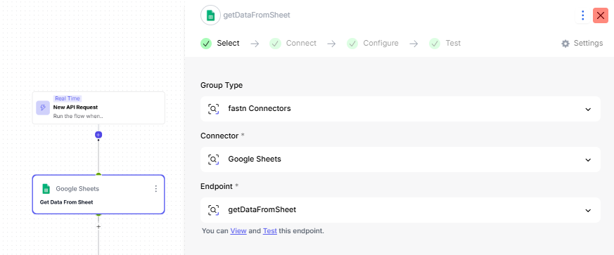

# Split

Divide a dataset into multiple branches based on selected fields or conditions.

The **Split** feature in **Flow Transformation** lets you break a large dataset into smaller, structured pieces that you can process independently in the next steps of your flow.

> This is especially helpful when a connector returns a large table or a complex object, and you only want to work with **specific portions,** such as selected columns, targeted attributes, or filtered sections of the data.

### **Use Case Example**

Imagine you have a Google Sheet storing thousands of rows of product data (Name, Category, Price, Stock, etc.). You only want to extract **specific columns**, for example, **Category and Price**, to send into another system (like an AI step, analytics tool, or external API).

Instead of passing the entire sheet, the **Split** feature lets you carve out only the fields you need.

Using **Includes Only**, you can split the dataset so only the selected fields move forward, simplifying your next steps and making your flow more efficient.

### Step 1: Add a Connector

* Start your flow by adding a connector that contains the data you want to split.

Add a _**Google Sheets**_ Connector and select the action _**getDataFromSheet**_.

<figure><figcaption></figcaption></figure>

* This step retrieves all the data from your sheet and provides it as the output for the next steps.

### Step 2: Add the Split Transformation

* After your connector step, click the '+' button to insert a new step.
* Search for **Flow Transformation Actions** and select **Split**.

<figure><figcaption></figcaption></figure>

* The Split step divides the data based on the input field and strategy you choose. Configure the Split step as follows:

**Fields To Split Out**

\{{steps.getDataFromSheet.output\}}

<figure><figcaption></figcaption></figure>


_This references the output from the previous connector step._


**Split Out Strategy**

The **Split Out Strategy** lets you decide whether to include only certain fields or exclude certain fields. &#x20;

As an example, we will choose the _Includes Only_ Strategy in this scenario.


You can choose Includes Only or Excludes Only, depending on your use case.&#x20;


<figure><figcaption></figcaption></figure>

**Input Fields**

You can select any input field you want to use for splitting, like the Major Dimensions of the data from the sheet, in this case.

<figure><figcaption></figcaption></figure>

Save the step.&#x20;

<figure><figcaption></figcaption></figure>

### Step 3: Testing the Split Step

You can test the split step to ensure it works as expected:

* Test the step directly from the **Test** inside the Split step.

<figure><figcaption></figcaption></figure>

* Next, test the entire flow from the **Test** button at the top-right corner of the flow editor.

<figure><figcaption></figcaption></figure>

### Using Split Data

Once the split step is configured, the resulting data can be used in further steps of your flow.&#x20;

For Example:

* Passing specific fields to another connector for processing.
* Filtering the dataset based on certain dimensions before performing calculations.
* Using split data as input for AI agents or custom code steps.
